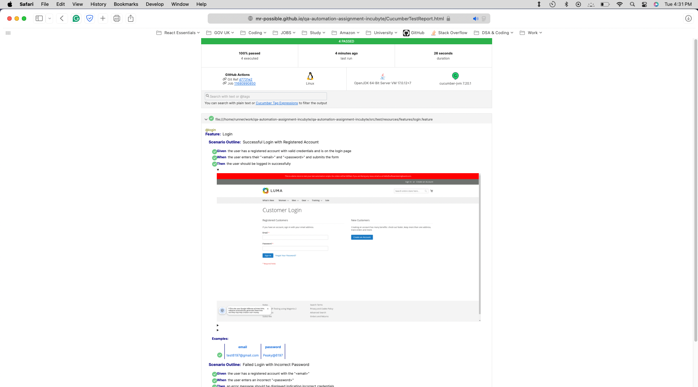

# QA Automation Framework (Assignment for Incubyte)

This code repository concerns the assignment for the position of Quality Assurance Craftsperson (Automation) at Incubyte.

Reference: https://incubyte-incubyte.zohorecruit.in/jobs/Careers/141457000000358005/TC---Automation?source=CareerSite

### Tech Stack that I have used:
- Java 17 (the main programming language)
- Selenium Webdriver (for UI tests)
- TestNG (the test runner)
- Cucumber (for structuring my test scenarios).

### Features:
- Thread-safe parallel execution
- Screenshot embedded for every step
- Github Actions integrated (for remote executions)
- Cucumber in-built reporting mechanism
- Maven commandline enabled execution

### Pre-requisities
- Need Java 17 on the machine.
- IntelliJ IDE (preferred)
- Git (for version control)

### Setup:
- Clone the repository - `git clone https://github.com/mr-possible/qa-automation-assignment-incubyte.git`
- Open in the IDE, then the terminal and run `./mvnw install -DskipTests`

### Run Tests:
- If you want to run all the tests, you can run: `./mvnw clean verify -Dtestng.dtd.http=true`
- If you want to run specific tagged tests, you can run: `./mvnw clean test -Dcucumber.filter.tags=@login` or `./mvnw clean test -Dcucumber.filter.tags=@signup`

### Exploring the reports (locally)
- After running any of the above command, please check `target/cucumber/CucumberTestReport.html` file.

### Exploring the reports (remotely)
- Sample Report Link: https://mr-possible.github.io/qa-automation-assignment-incubyte/CucumberTestReport.html
- The above URL is updated whenever a new github action workflow is run (because of manual intervention, a push to the master branch or on a PR to the master branch).

#### Some screenshots

